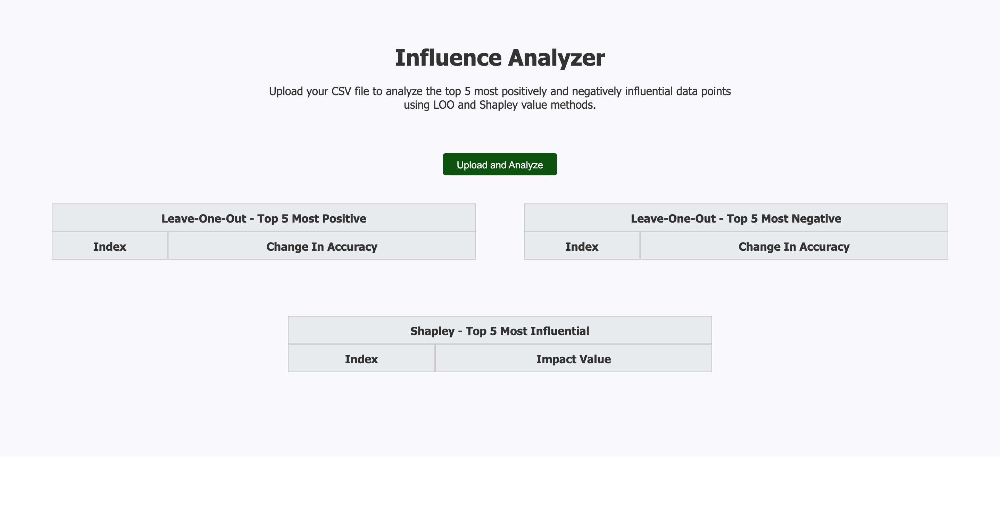
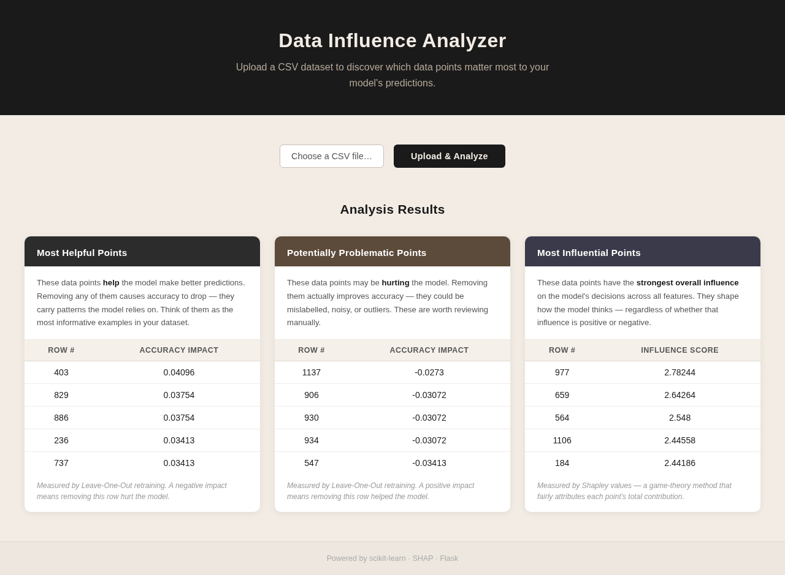

# Data Influence Analysis

A Flask web application that identifies the most influential data points in a dataset using **Leave-One-Out (LOO)** and **Shapley value** methods. Upload any CSV file and the app trains a Random Forest classifier, then ranks which training samples most positively or negatively affect model accuracy.

---

## Screenshots

### Landing Page


### Results


---

## How It Works

**Leave-One-Out (LOO):** For each training sample, the model is retrained with that point removed. The change in accuracy relative to the baseline tells you how much that point contributes — a positive value means removing it hurts accuracy (the point is helpful), a negative value means removing it improves accuracy (the point may be noisy or mislabelled).

**Shapley Values:** Uses the [SHAP library](https://github.com/slundberg/shap) to approximate each training sample's contribution across all features and classes. Total absolute SHAP values are summed per sample to rank the top 5 most globally influential data points.

---

## Setup

**Requirements:** Python 3.9+

```bash
# Clone the repository
git clone https://github.com/arvinbm/DATA_INFLUENCE_ANALYSIS.git
cd DATA_INFLUENCE_ANALYSIS

# Create and activate a virtual environment
python3 -m venv venv
source venv/bin/activate        # macOS / Linux
# venv\Scripts\activate         # Windows

# Install dependencies
pip install -r requirements.txt

# Start the server
python3 app.py
```

Then open [http://localhost:5050](http://localhost:5050) in your browser.

---

## Usage

1. Click **Choose File** and select a CSV file. The last column is automatically used as the target label.
2. Click **Upload and Analyze**.
3. The app returns three ranked tables:
   - **LOO - Top 5 Most Positive:** points whose removal hurts accuracy the most (most helpful to the model)
   - **LOO - Top 5 Most Negative:** points whose removal improves accuracy (potentially noisy or mislabelled)
   - **Shapley - Top 5 Most Influential:** top samples by total absolute SHAP impact across all features and classes

A sample dataset (`uploaded_files/seattle-weather.csv`) is included for testing.

---

## Project Structure

```
DATA_INFLUENCE_ANALYSIS/
├── app.py                    # Flask server — file upload and routing
├── loo_shapley.py            # Core analysis — LOO and Shapley value computation
├── templates/
│   └── index.html            # Frontend UI
├── static/
│   ├── script.js             # Handles upload requests and renders result tables
│   └── style.css             # Styles
├── uploaded_files/
│   └── seattle-weather.csv   # Sample dataset for testing
├── screenshots/              # UI screenshots used in this README
├── requirements.txt
└── CMPT_419_Project_Report.pdf
```

---

## Tech Stack

| Layer | Technologies |
|---|---|
| Backend | Python, Flask, scikit-learn (RandomForestClassifier), SHAP, pandas, NumPy |
| Frontend | Vanilla JavaScript, HTML5, CSS3 |
| Analysis | Leave-One-Out retraining, Shapley value approximation via SHAP TreeExplainer |
